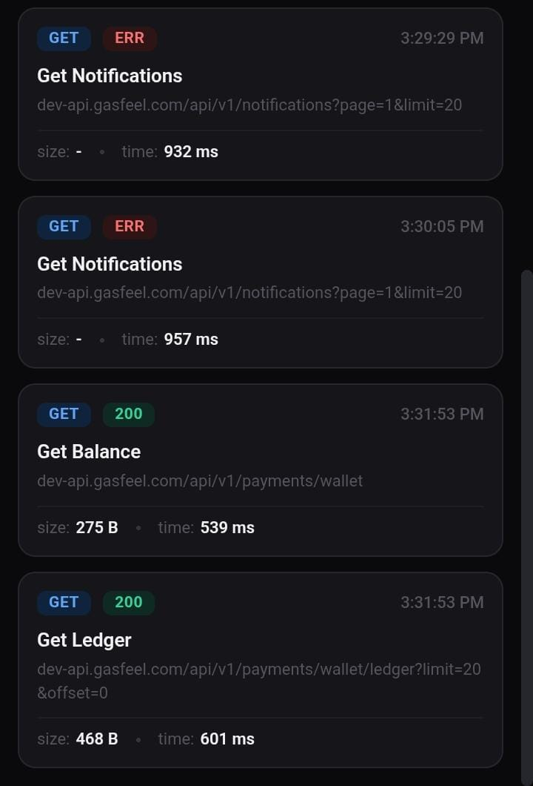
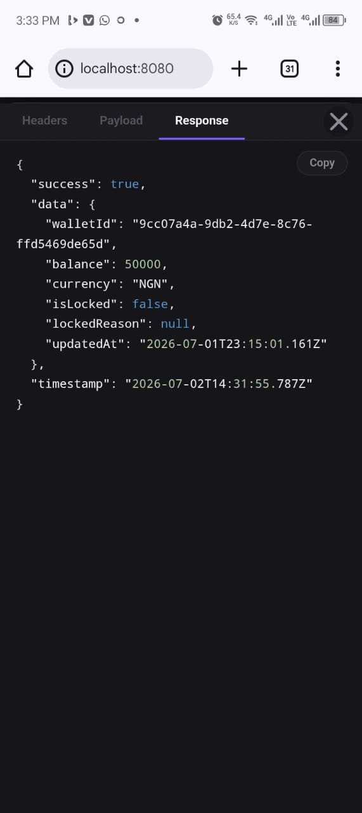
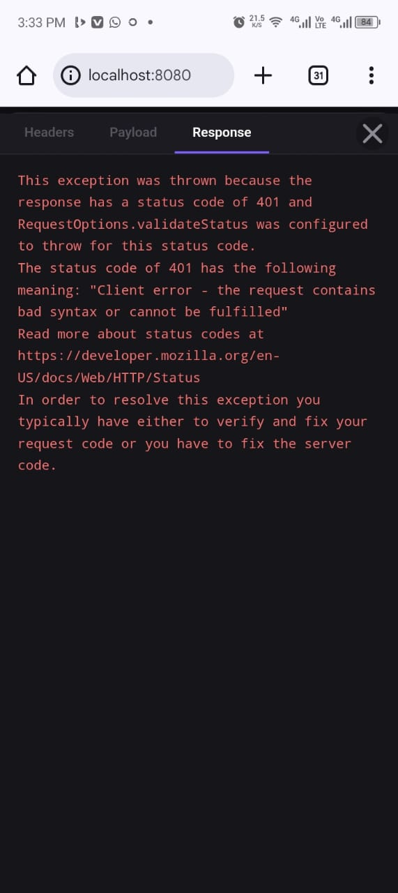

A Dio HTTP interceptor that captures all network traffic and serves a real-time web UI — like Chrome DevTools Network tab, but for your Flutter app.

Open `http://localhost:8080` while your app runs and inspect every request: method, status, headers, payload, response body, timing, and more.

## Screenshots

| Card view                        | Response detail | Error view                      |
|----------------------------------|---|---------------------------------|
|  |  |  |

## Features

- **Dio interceptor** — drop-in `Interceptor` that captures requests, responses, and errors
- **Real-time web UI** — dark-themed dashboard with method badges, status codes, response size, duration, and syntax-highlighted JSON
- **Live updates via WebSocket** — new requests appear instantly without refreshing
- **Request naming** — give friendly names to requests via Dio's `extra` map; falls back to URL
- **Search/filter** — filter requests by URL in real time
- **Responsive** — card layout on mobile, table layout on desktop
- **Resizable detail panel** — drag to resize the headers/payload/response inspector
- **Copy to clipboard** — one-click copy on payload and response bodies
- **Toggle at runtime** — enable/disable logging, useful for production builds

## Getting started

Add `net_logs` to your `pubspec.yaml`:

```yaml
dependencies:
  net_logs:
    git: https://github.com/your-username/net_logs.git
```

Or after publishing:

```yaml
dependencies:
  net_logs: ^0.0.1
```

## Usage

### 1. Add the interceptor to Dio

```dart
import 'package:dio/dio.dart';
import 'package:net_logs/net_logs.dart';

final interceptor = NetLogsInterceptor();
final dio = Dio()..interceptors.add(interceptor);
```

### 2. Start the web server

```dart
final server = NetLogsServer(interceptor: interceptor);
await server.start(); // defaults to port 8080
```

### 3. Open the dashboard

Navigate to `http://localhost:8080` in your browser. Every HTTP request made through your Dio instance will appear in real time.

### Disable in production

```dart
// e.g., only enable in debug mode
if (kReleaseMode) interceptor.setEnabled(false);
```

Or skip starting the server entirely:

```dart
if (kDebugMode) await server.start();
```

### Custom port

```dart
await server.start(port: 3000);
```

### Stop the server

```dart
await server.stop();
```

### Request names

Give requests a friendly name so they're easy to identify in the log table:

```dart
await dio.get(
  '/api/users',
  options: Options(extra: {'requestName': 'Fetch Users'}),
);

await dio.post(
  '/api/login',
  data: {'email': 'user@example.com'},
  options: Options(extra: {'requestName': 'Login'}),
);
```

When a name is set, it appears prominently in the table and detail panel instead of the raw URL.

## Web UI

| Column | Description |
|---|---|
| **#** | Request counter |
| **Method** | Colored badge (GET/POST/PUT/DELETE/…) |
| **URL / Name** | Friendly name if set, otherwise `host/path` |
| **Status** | Colored badge (2xx/3xx/4xx/5xx/ERR) |
| **Size** | Response body size |
| **Duration** | Request round-trip time |
| **Time** | Local timestamp |

Click any row to open the detail panel with three tabs:

- **Headers** — request URL, method, duration, all request/response headers
- **Payload** — formatted and syntax-highlighted request body (JSON)
- **Response** — formatted and syntax-highlighted response body (JSON)

## API

### `NetLogsInterceptor`

| Member | Description |
|---|---|
| `enabled` | Whether logging is active |
| `setEnabled(bool)` | Enable/disable at runtime |
| `clear()` | Clear all captured logs |
| `logs` | Unmodifiable list of captured `LogEntry` |
| `logStream` | Broadcast stream of new `LogEntry` instances |
| `dispose()` | Close the stream |

### `NetLogsServer`

| Member | Description |
|---|---|
| `start({int? port})` | Start the HTTP server |
| `stop()` | Stop the server and disconnect all WebSocket clients |
| `isRunning` | Whether the server is currently running |
| `port` | The port the server is listening on |

### `LogEntry`

| Field | Type | Description |
|---|---|---|
| `id` | `int` | Auto-incrementing ID |
| `timestamp` | `DateTime` | When the request was made |
| `method` | `String` | HTTP method |
| `url` | `String` | Full request URL |
| `name` | `String?` | Optional friendly name from `extra['requestName']` |
| `displayName` | `String` | `name ?? url` |
| `requestHeaders` | `Map<String, String>` | Request headers |
| `requestBody` | `String?` | Pretty-printed request body |
| `statusCode` | `int?` | HTTP status code |
| `responseHeaders` | `Map<String, String>?` | Response headers |
| `responseBody` | `String?` | Pretty-printed response body |
| `duration` | `Duration?` | Round-trip time |
| `error` | `String?` | Error message if the request failed |

## Additional information

- **Issues:** Report bugs or request features on [GitHub Issues](https://github.com/your-username/net_logs/issues).
- **License:** This project is licensed under the MIT License — see the [LICENSE](LICENSE) file for details.
